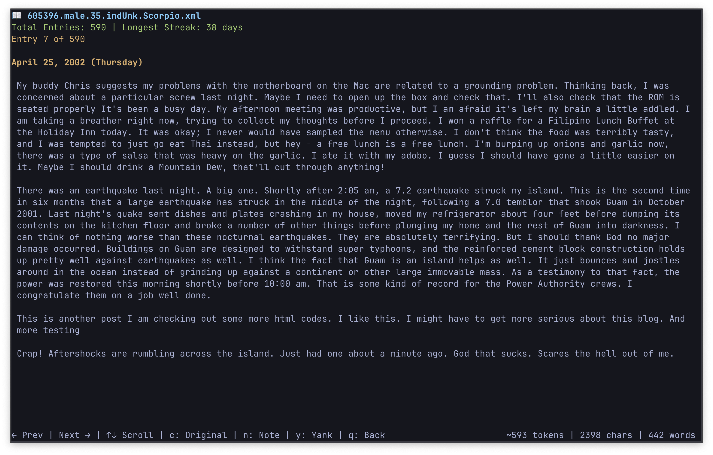

# Blogger Browser



This project enhances the [Blog Authorship Corpus](https://www.kaggle.com/datasets/rtatman/blog-authorship-corpus/data) dataset with a custom analyzer and interactive reader to find high-quality, consistent bloggers.

## Features

### Reader UI (`reader.py`)
- Interactive journal selection with `fzf` showing metrics and notes
- Word wrapping and smooth scrolling for long entries
- Combines multiple same-day posts into single entries
- **Navigation**: Arrow keys or vim keybindings (`h`/`l` for previous/next entry, `j`/`k` for scroll down/up)
- **Text cleaning**: Press `c` to toggle between original and cleaned text views
  - Removes extra spaces, excessive blank lines, and `urlLink` markers
  - All source data preserved; cleaning is in-memory only
- **Clipboard integration**: Press `y` to yank (copy) current entry to clipboard (works for both original and cleaned text)
- **Journal notes**: Press `n` to add notes; annotated journals prioritized in selector and persist in CSV
- Token estimation, word count, and character count displayed in footer

### Analysis (`analyze_blogs.py`)
- Parses all journals and calculates continuity metrics (streaks, gaps, isolated entries)
- Computes word statistics (total words, average per entry, largest entry)
- Filters journals to those with 30+ entries
- Generates `journal_analysis.csv` sorted by total entries and longest streak


## Setup

1. Download `blogs.zip` from the [HuggingFace](https://huggingface.co/datasets/barilan/blog_authorship_corpus) repo
2. Unzip in the root project directory to create a `/blogs` directory
3. Filter the dataset by file size:

   The original dataset contains 19,320 blog files, but many are too short for meaningful analysis. Filtering to blogs larger than 100kb (approximately 1,700 files) focuses on higher-quality, more substantial journals. You can adjust the threshold or copy all files as desired.

   **macOS/Linux command** to copy files >100kb:
   ```bash
   find blogs -name "*.xml" -size +100k -exec cp {} data/ \;
   ```

   Alternatively, manually sort files in `/blogs` by size and copy desired files to `/data`.

   Optionally delete the original `/blogs` directory to save space after copying.

4. Install `fzf` via `brew install fzf` (macOS) or your system's package manager
5. Run `python analyze_blogs.py` to generate `journal_analysis.csv`
6. Run `python reader.py` to interactively browse journals

**Dependencies**: Python 3 standard library, `fzf` (command-line fuzzy finder). The `curses` module is included with Python on Unix/macOS systems.

## Dataset Information

The Blog Authorship Corpus consists of 19,320 blogs from blogger.com, collected in August 2004. Each blog represents a single user's writing. The complete corpus contains 681,288 posts and over 140 million words (approximately 35 posts and 7,250 words per person).

### Blogger Demographics

All bloggers fall into one of three age groups with equal gender distribution:
- 8,240 "10s" blogs (ages 13-17)
- 8,086 "20s" blogs (ages 23-27)
- 2,994 "30s" blogs (ages 33-47)

### File Format

Each blog is stored as an XML file named: `author_id.gender.age.job.horoscope.xml`

Example: `4334776.male.24.Engineering.Aquarius.xml`

All blogs are labeled with gender and age; industry and astrological sign are marked as "unknown" for some users.

### Content Structure

- Each blog includes at least 200 occurrences of common English words
- All HTML formatting has been stripped
- Individual posts are separated by `<date>` tags in format: `DD,Month,YYYY`
- Links are denoted by the label `urlLink` (actual URLs were removed during corpus creation)

The original 2006 research paper that inspired the dataset curation is included in this repository.

## Links

- **Original Source**: https://u.cs.biu.ac.il/~koppel/BlogCorpus.htm
- **Kaggle**: https://www.kaggle.com/datasets/rtatman/blog-authorship-corpus/data
- **HuggingFace**: https://huggingface.co/datasets/barilan/blog_authorship_corpus

## Citation

The corpus may be freely used for non-commercial research purposes. Publications using this dataset should cite:

J. Schler, M. Koppel, S. Argamon and J. Pennebaker (2006). Effects of Age and Gender on Blogging in Proceedings of 2006 AAAI Spring Symposium on Computational Approaches for Analyzing Weblogs. http://www.cs.biu.ac.il/~schlerj/schler_springsymp06.pdf
